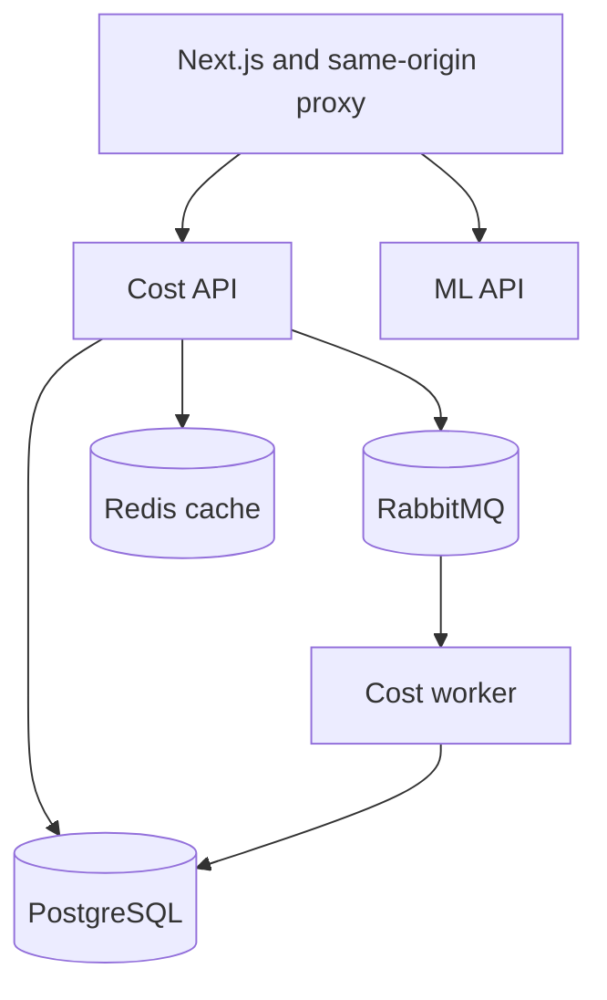

# CloudPulse AI

<div align="center">


[](https://opensource.org/licenses/MIT)
[](https://www.python.org/)
[](https://nextjs.org/)
[](https://fastapi.tiangolo.com/)

### Predict cloud costs before they surprise you. Ask questions in plain English.

*An open-source, privacy-first FinOps platform with AI-powered forecasting and natural language queries.*

[Quick Start](#-quick-start) | [Features](#-features) | [Architecture](#-architecture) | [Contributing](CONTRIBUTING.md)

</div>

---

## Why I Built This

Existing FinOps tools show you what you **already spent**. That's not helpful when your bill arrives.

I wanted a tool that:
- **Predicts** next month's costs with optional foundation-model inference (Amazon Chronos) and a deterministic local fallback
- **Explains** cost spikes in plain English ("Why did EC2 costs jump last Tuesday?")
- **Simulates** savings scenarios before you commit ("What if I move 40% to Spot?")
- **Runs locally** - your billing data never leaves your VPC

CloudPulse AI is my answer to: *"What if FinOps tools were actually proactive?"*

---

## Demo

<!-- Add your screenshots/GIFs here -->
<div align="center">

| **Mission Control** | **AI Predictions** |
|:---:|:---:|
|  |  |

| **Cloud Accounts** | **FinOps Analyst** |
|:---:|:---:|
|  |  |

</div>

---

## Features

### AI-Powered Cost Forecasting
- **Amazon Chronos** (T5-based foundation model) when the optional inference extra and model weights are installed
- Deterministic moving-average/trend fallback keeps the local demo reproducible without model downloads
- Confidence intervals (10th-90th percentile) for risk assessment
- No training required - works out of the box with your data

### Natural Language Queries
- *"Why did my costs spike last week?"*
- *"Which service is growing fastest?"*
- Works with OpenAI, Claude, Gemini, or local models (Ollama)
- Uses cost data already stored in CloudPulse as chat context

### What-If Cost Simulator
- Interactive scenarios: *"What if I move 40% to Spot Instances?"*
- Real-time savings projections
- Client-side calculations - no backend latency

### Anomaly Detection
- Isolation Forest algorithm detects unusual spending patterns
- Detector artifacts are persisted per organization, never in process-global tenant state
- Automatic alerts for cost spikes

### Multi-Cloud Ready
- Unified provider abstraction layer
- AWS Cost Explorer, Azure Cost Management, and GCP BigQuery billing adapters
- Extensible for custom/on-prem providers

---

## Architecture

```
                              CloudPulse AI
    ================================================================
    
         [Frontend]              [Monitoring]         [Tracing]
          Next.js            Prometheus / Grafana    OTel / Tempo
           :3005                :9090 / :3001       :4317 / :3200
              |                       |                   |
    ----------|=======================|===================|------
              |                       |                   |
              v                       v                   v
    ================================================================
               Next.js Same-Origin API Proxy Layer
    ================================================================
              |                                           |
              v                                           v
    +-------------------+                     +-------------------+
    |   Cost Service    |                     |    ML Service     |
    |     (FastAPI)     |                     |     (FastAPI)     |
    |       :8001       |                     |       :8002       |
    |                   |                     |                   |
    | - Cost aggregation|                     | - Optional Chronos |
    | - Provider sync   |                     | - Isolation Forest|
    | - K8s attribution |                     | - LLM integration |
    +-------------------+                     +-------------------+
              |                                           |
    ----------|===========================================|----------
              |                  |                        |
              v                  v                        v
    +----------+  +---------+  +------------+  +------------------+
    | Postgres |  |  Redis  |  |  RabbitMQ  |  | Cloud Provider   |
    |   :5432  |  |  :6379  |  | :5672*    |  | APIs (AWS, etc.) |
    +----------+  +---------+  +------------+  +------------------+
                                     ^
                                     |
                          +-------------------+
                          |    Cost Worker    |
                          | (Background Job)  |
                          | - Data Syncing    |
                          +-------------------+
```

---

## Interview Demo — 5 Minutes

1. From a fresh clone, run `docker compose up --build --detach --wait --wait-timeout 300` and `docker compose ps`. This waits for the migration, synthetic seed, and service health checks.
2. Open http://localhost:3005 and sign in with the demo login below. Show the four AWS, Azure, and GCP-shaped accounts, then the cost history and service breakdown.
3. In Cost Explorer, select Last 90 Days and Demo Incident Recovery to show the seeded cost spike. Open Anomalies and Predictions for their current 30-day analysis and seven-day fallback forecast. These are synthetic fixtures, not a validated cloud bill or Chronos inference.
4. Run `bash scripts/demo-smoke.sh` to exercise the same-origin frontend proxy, API, ML endpoints, worker sync lifecycle, Prometheus targets, and service health checks. Show `docker compose logs --tail=40 cost-worker`.
5. Open http://localhost:9090 for Prometheus targets and http://localhost:3001 for Grafana (demo credentials below). Show the service health endpoints at `localhost:8001/health` and `localhost:8002/health`.

## Architecture Decisions



PostgreSQL stores tenant-scoped accounts and cost records. RabbitMQ separates ingestion from request latency; the draft hardening introduces durable sync task state and bounded retries, with crash recovery still requiring integration validation. The same-origin frontend proxy keeps browser API calls on one origin. The local demo disables live cloud sync and external LLM calls. Aggregations distinguish currencies instead of summing unrelated monetary units. Prometheus, Grafana, Tempo, and OpenTelemetry provide a local observability example; alert delivery and real provider accounts are outside the credential-free demo.

**Validation boundaries:** The synthetic demo and repository tests exercise local behavior. AWS Cost Explorer, Azure Cost Management, GCP billing export, optional Chronos weights, and LLM providers need separate credentials and integration checks. This repository should be described as a FinOps reference implementation with a reproducible local demo, not as a validated live multi-cloud service.

## Quick Start

### Prerequisites
- Docker & Docker Compose
- Bash, curl, and Python 3 for `scripts/demo-smoke.sh` (Linux or Windows with WSL2)
- 4GB RAM for the complete local observability stack

### 1. Start The Safe Demo

```bash
git clone https://github.com/abhisek343/cloudpulse.git
cd cloudpulse
docker compose up --build --detach --wait --wait-timeout 300
```

That one command runs Alembic migrations and idempotently seeds a synthetic demo tenant before the API, worker, and frontend start. It requires no `.env` file and no cloud credentials. By default, CloudPulse runs in safe demo mode:
- no real cloud API calls
- no cloud credentials required
- local-only synthetic billing data paths
- no external LLM calls
- Alertmanager records local alert state but does not send webhooks
- live provider credentials cannot be stored unless ACCOUNT_CREDENTIALS_KEY is configured

The automatic seed creates:
- a demo admin user
- four demo accounts across AWS, Azure, and GCP-shaped workloads
- deterministic cost history with spikes, credits, tag gaps, service-mix shifts, and seasonality

### Demo Login

```text
Email:    demo@cloudpulse.local
Password: DemoPass123!
```

### Access Points

| Service | URL | Notes |
|---------|-----|-------|
| **Dashboard** | http://localhost:3005 | Main UI |
| **Settings** | http://localhost:3005/settings | Demo/live mode and provider readiness |
| **Cost API** | http://localhost:8001/docs | Swagger docs |
| **ML API** | http://localhost:8002/docs | Swagger docs |
| **Grafana** | http://localhost:3001 | admin / cloudpulse |
| **Prometheus** | http://localhost:9090 | Metrics |
| **Tempo** | http://localhost:3200 | Trace backend API |
| **Alertmanager** | http://localhost:9093 | Local alert state (no outbound receiver) |
| **OTel health** | http://localhost:13133 | Collector readiness |

### Distributed Tracing

- `cost-service`, `cost-worker`, and `ml-service` export OTLP traces to the local OpenTelemetry Collector.
- The collector forwards traces to Tempo, which is pre-provisioned in Grafana Explore.
- RabbitMQ sync tasks propagate W3C trace context so API-triggered sync work stays on the same trace in the worker.

### Common Local Commands

```bash
# Stop services
docker compose down

# Rebuild after backend/frontend changes
docker compose up --build -d

# Reseed demo data
docker compose exec cost-service python /app/scripts/seed_data.py --reset

# Verify API, UI, monitoring, alerting, and safe demo mode
bash scripts/demo-smoke.sh
```

If host ports 5672 or 15672 are already occupied, set RABBITMQ_HOST_PORT and
RABBITMQ_MANAGEMENT_HOST_PORT (for example 5673 and 15673) before each
Compose command. The container-to-container RabbitMQ URL remains on port 5672.

The local ML container intentionally omits the optional Chronos model download. Forecasts use a deterministic fallback until the inference extra and weights are installed; anomaly detector artifacts are persisted under an organization-scoped path in the ml_models volume. The predictor stores no tenant history. To build a heavier local inference image, run INSTALL_ML_INFERENCE=true docker compose up --build -d and ensure the build host can download the model dependencies.

### Live Provider Deployments

The checked-in `docker-compose.yml` is intentionally a **demo-only profile**.
It pins `CLOUD_SYNC_MODE=demo` and `ALLOW_LIVE_CLOUD_SYNC=false` for the API,
worker, and seed job, so changing those values in a root `.env` file does **not**
turn the local demo into a live-cloud deployment. It must not be pointed at a
production account or database.

Live sync is an application capability, not a claim that the demo Compose stack
has been production-approved. Deploy the cost API and worker through your own
deployment configuration, without the demo seed job, and explicitly inject the
following into both processes:

```env
CLOUD_SYNC_MODE=live
ALLOW_LIVE_CLOUD_SYNC=true
```

Use non-demo database, message-queue, JWT, internal-service, and credential-encryption secrets;
set ACCOUNT_CREDENTIALS_KEY to a valid Fernet key before storing live account credentials;
apply least-privilege provider credentials; and run the authenticated provider preflight
endpoint before scheduling a sync. The repository does not ship a live-provider
Compose override or tested production manifests.

Provider requirements:

- AWS: Cost Explorer access and credentials available to both the API and worker.
- Azure: Cost Management reader access plus subscription, tenant, and client credentials.
- GCP: a BigQuery billing export and a principal that can read the configured export table.

Provider readiness currently supported by the service:
- AWS: live sync plus in-app preflight validation
- Azure: live sync plus in-app tenant/API preflight validation
- GCP: live path through a standard BigQuery billing export

AWS:

```env
AWS_ACCESS_KEY_ID=your-key
AWS_SECRET_ACCESS_KEY=your-secret
AWS_REGION=us-east-1
```

Azure:

```env
AZURE_SUBSCRIPTION_ID=your-subscription-id
AZURE_TENANT_ID=your-tenant-id
AZURE_CLIENT_ID=your-client-id
AZURE_CLIENT_SECRET=your-client-secret
NEXT_PUBLIC_DEFAULT_ACCOUNT_PROVIDER=azure
```

GCP:

```env
GCP_PROJECT_ID=your-project-id
GCP_BILLING_ACCOUNT_ID=your-billing-account-id
GCP_SERVICE_ACCOUNT_JSON={"type":"service_account","project_id":"..."}
GCP_BILLING_EXPORT_TABLE=your-project.your_dataset.gcp_billing_export_v1
NEXT_PUBLIC_DEFAULT_ACCOUNT_PROVIDER=gcp
```

1. Add a real cloud account from the UI and trigger sync only after preflight succeeds.

2. Open `Settings` and run provider preflight checks to verify credentials, API access,
   and the cost source before you trust a live sync.

For supported live providers, CloudPulse falls back to env-backed provider credentials
when the account record itself does not include credential fields. That keeps the OSS
setup plug-and-play while still allowing per-account overrides.

The runtime mode and provider readiness snapshot is available at `/api/v1/health/runtime`
and surfaced in the Settings page so users can verify their live/demo state immediately.
CloudPulse also exposes `/api/v1/health/preflight/{provider}` for AWS, Azure, and GCP,
which runs a lightweight live smoke test and reports missing env vars or access issues.

---

## Tech Stack

| Layer | Technology | Why |
|-------|------------|-----|
| **ML/AI** | Optional Amazon Chronos (T5), scikit-learn | Forecasting with deterministic fallback and organization-scoped anomaly models |
| **Backend** | FastAPI, SQLAlchemy 2.0, Pydantic | Async-first, type-safe Python |
| **Frontend** | Next.js 16, TypeScript, Tailwind | Modern React with App Router |
| **Data** | PostgreSQL, Redis, RabbitMQ | Battle-tested infrastructure |
| **Observability** | Prometheus, Grafana | Production-ready monitoring |

---

## Project Structure

```
cloudpulse-ai/
├── services/
│   ├── cost-service/          # Cost data ingestion & aggregation
│   │   ├── app/
│   │   │   ├── api/           # REST endpoints
│   │   │   ├── services/      # Business logic + provider adapters
│   │   │   └── models/        # SQLAlchemy models
│   │   ├── worker.py          # Background task worker
│   │   └── tests/
│   │
│   └── ml-service/            # Predictions & anomaly detection
│       ├── app/
│       │   ├── api/           # ML endpoints
│       │   └── services/      # Chronos + Isolation Forest
│       └── tests/
│
├── frontend/                  # Next.js dashboard
├── monitoring/                # Prometheus + Grafana configs
├── docker-compose.yml
└── README.md
```

---

## API Reference

### Cost Service (`/api/v1`)

| Endpoint | Method | Description |
|----------|--------|-------------|
| `/costs/summary` | GET | Aggregated cost summary |
| `/costs/trend` | GET | Historical cost trend |
| `/costs/by-service` | GET | Breakdown by cloud service |
| `/accounts/` | POST | Register cloud account |
| `/accounts/{id}/sync` | POST | Trigger cost sync |

### ML Service (`/api/v1/ml`)

| Endpoint | Method | Description |
|----------|--------|-------------|
| `/predict` | POST | Generate cost forecast |
| `/detect` | POST | Run anomaly detection |
| `/train` | POST | Initialize models with data |
| `/status` | GET | Model health check |

---

## Development

```bash
# Root env used by docker-compose
cp .env.example .env

# Backend (cost-service)
cd services/cost-service
pip install -e ".[dev]"
pytest -v --cov=app

# Backend (ml-service)
cd services/ml-service
pip install -e ".[dev]"
pytest -v --cov=app

# Install the Chronos/Torch inference stack only when you need real model inference
pip install -e ".[inference]"

# Frontend
cd frontend
npm install
npm run dev
```

### Verification

```bash
# Frontend
cd frontend
npm run lint
npm run test
npm run build

# Cost service
cd services/cost-service
pytest -q

# ML service
cd services/ml-service
pytest -q
```

### Deployment

- Deployment guide: [docs/deployment.md](docs/deployment.md)
- Cost-service schema changes are managed through Alembic in `services/cost-service/alembic/versions`.
- Prometheus alert rules live in `monitoring/prometheus/alerts.yml`.

### Environment Notes

- Root `.env.example` is the easiest starting point for the local **demo** Docker stack. It is not a live-sync switch because `docker-compose.yml` pins safe demo settings.
- Cost-service-specific defaults also live in `services/cost-service/.env.example`.
- Real provider sync is disabled by default. A production deployment must set `ALLOW_LIVE_CLOUD_SYNC=true` and `CLOUD_SYNC_MODE=live` in both the API and worker; the checked-in demo Compose stack always keeps both values safe.
- Chat is disabled in the local Compose demo and external inference is opt-in. Configure LLM_API_KEY and explicitly enable external inference only in a deployment that has reviewed the data policy.
- The ML service keeps heavy Chronos/Torch dependencies behind the inference extra so tests and CI stay lightweight.
- Cost aggregation groups records by currency; a mixed-currency tenant receives grouped totals and ML pages require a single currency. CloudPulse does not invent FX conversions or label mixed totals as USD.

---

## Roadmap

- [x] AWS Cost Explorer integration
- [x] Optional Amazon Chronos forecasting with deterministic fallback
- [x] Anomaly detection with Isolation Forest
- [x] Natural language chat interface
- [x] Azure Cost Management integration (live sync, preflight validation)
- [x] GCP Billing integration via BigQuery export (live sync, preflight validation)
- [x] Multi-turn chat with conversation memory
- [x] Kubernetes namespace cost attribution
- [x] Slack/Teams alerting
- [x] Terraform cost estimation (pre-deploy)

---

## Contributing

Contributions are welcome! See [CONTRIBUTING.md](CONTRIBUTING.md) for guidelines.

**Good first issues:**
- Improve anomaly detection sensitivity tuning
- Add more chart visualizations
- Add custom cost allocation tag support
- Add cost optimization recommendations

---

## License

MIT License - see [LICENSE](LICENSE) for details.


<div align="center">

**If this helped you understand cloud costs better, consider giving it a star!**

</div>

## Cloud demo

[](docs/demo/cloudpulse-demo.mp4)

This recording is generated on a clean GitHub Actions Ubuntu runner. It starts the safe synthetic-data stack, exercises the dashboard/API/monitoring path, and records the local CloudPulse dashboard. No cloud credentials or external provider calls are used.

To reproduce locally:

    docker compose up --build -d
    bash scripts/demo-smoke.sh

The local dashboard is available at http://localhost:3005. The demo stack is intentionally separate from live AWS, Azure, and GCP deployments.
